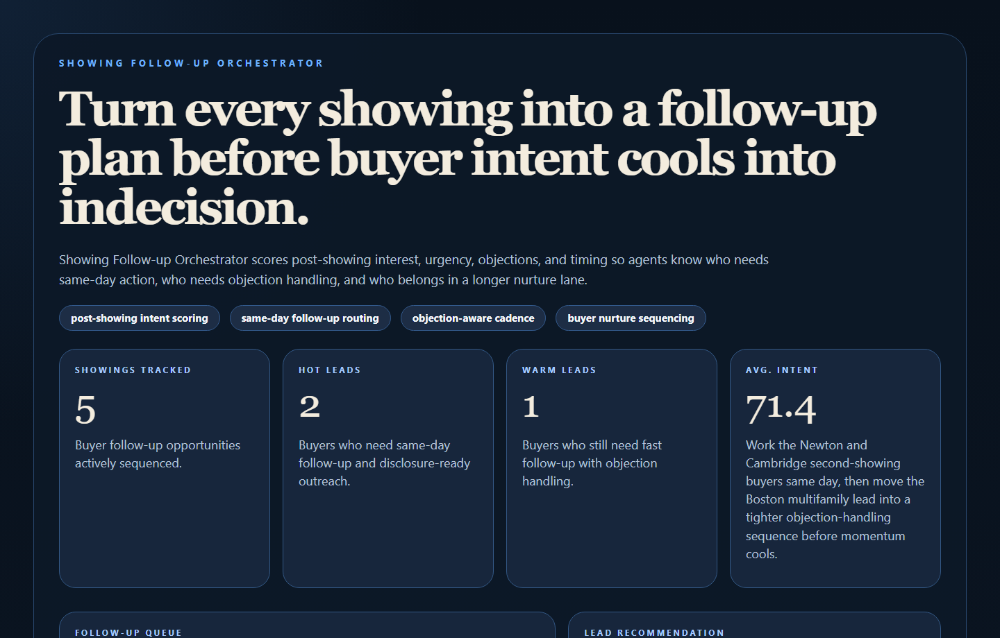
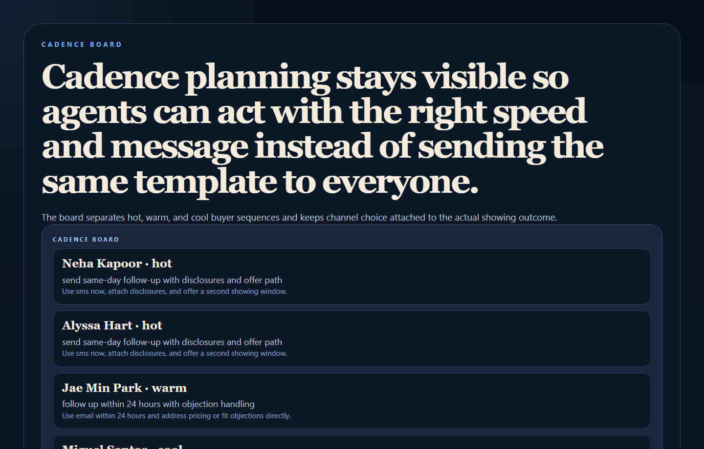
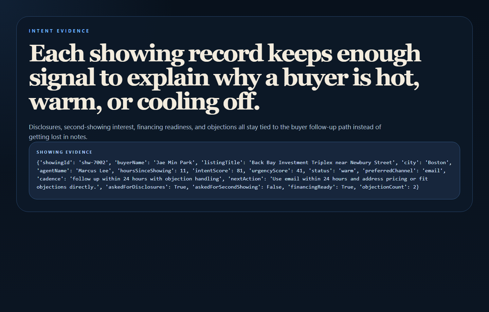
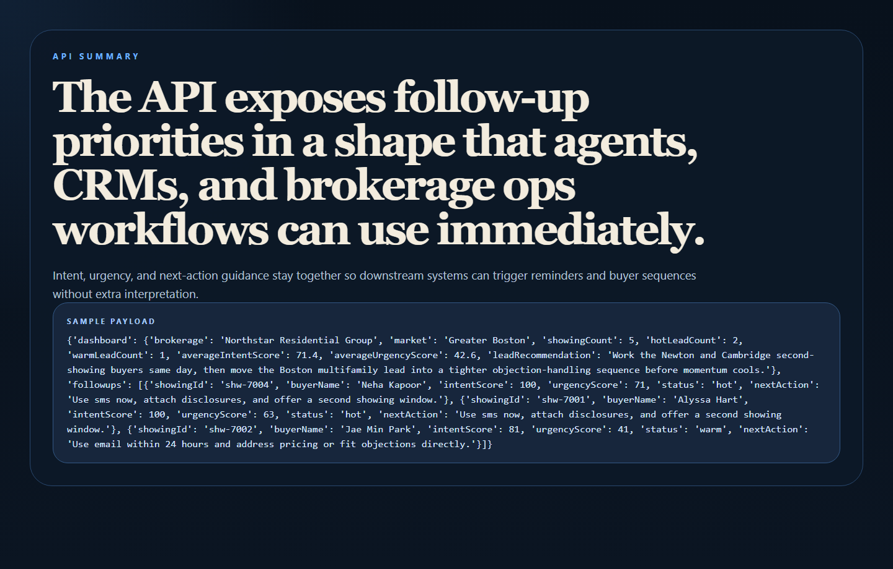

# Showing Follow-up Orchestrator

Showing Follow-up Orchestrator is a real estate workflow engine for turning property showings into smarter follow-up sequences, buyer-intent scoring, and agent reminder plans.



## Why this repo is good

- It targets a highly practical brokerage problem right after the showing, when intent can rise or disappear fast.
- It pairs perfectly with `lead-routing-command-center` and `property-schema-publisher`.
- It combines sales operations, cadence logic, buyer psychology, and workflow timing in one productized repo.

## What it does

- Scores post-showing buyer intent and urgency.
- Chooses follow-up cadence based on recency, disclosures, second-showing interest, financing readiness, and objections.
- Keeps channel choice attached to the buyer record instead of buried in notes.
- Exposes an operator-facing proof surface plus a clean API.

## Proof





## Local run

```powershell
cd showing-followup-orchestrator
py -3.11 -m venv .venv
.\.venv\Scripts\pip.exe install -r requirements.txt
.\.venv\Scripts\python.exe -m app.main
```

Open:

- `http://127.0.0.1:4806/`
- `http://127.0.0.1:4806/cadence-board`
- `http://127.0.0.1:4806/intent-evidence`
- `http://127.0.0.1:4806/docs`

## Validation

```powershell
.\.venv\Scripts\python.exe -m unittest discover -s tests
.\.venv\Scripts\python.exe scripts\run_demo.py
.\.venv\Scripts\python.exe scripts\smoke_check.py
.\.venv\Scripts\python.exe scripts\render_readme_assets.py
```

## API shape

Endpoints:

- `/api/dashboard/summary`
- `/api/showings`
- `/api/showings/{showing_id}`
- `/api/sample`

## Repo layout

```text
app/
  data/
  services/
docs/
scripts/
screenshots/
tests/
```
